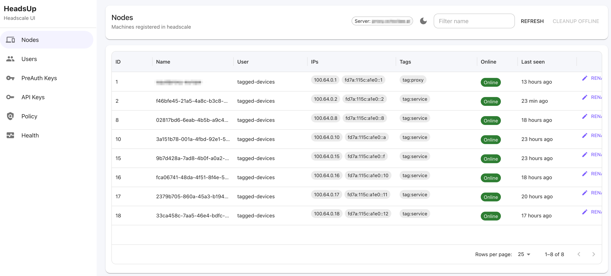
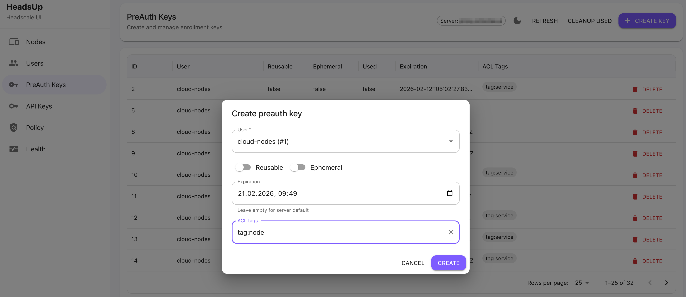

# HeadsUp

A self-contained web UI for the [Headscale](https://github.com/juanfont/headscale) API.

## Screenshots





## Configuration

Set env vars (the app reads both `VITE_*` and non-prefixed variants):

- `VITE_BASE_URL` (or `BASE_URL`) – base URL to your Headscale instance
- `VITE_APIKEY` (or `APIKEY`) – API key used as `Authorization: Bearer <key>`

Create a local `.env`:

```bash
cp .env.example .env
```

## Run

```bash
npm install
npm run dev
```

## Docker

The Docker image serves static files via nginx.

### Runtime configuration

In Docker, `BASE_URL` and `APIKEY` are injected at **container start** into `/config.js`.

Required env vars:

- `BASE_URL` (or `VITE_BASE_URL`)
- `APIKEY` (or `VITE_APIKEY`)

### Build and run

```bash
docker build -t headsup .
docker run --rm -p 8081:80 \
  -e BASE_URL="http://localhost:8080" \
  -e APIKEY="your_api_key_here" \
  headsup
```

Then open:

- http://localhost:8081

### docker-compose

Edit `docker-compose.yaml` and run:

```bash
docker compose up --build
```

## Security note

When creating secrets like **PreAuth keys** and **API keys**, the UI will display the secret exactly once in a dedicated dialog and does not persist it.
